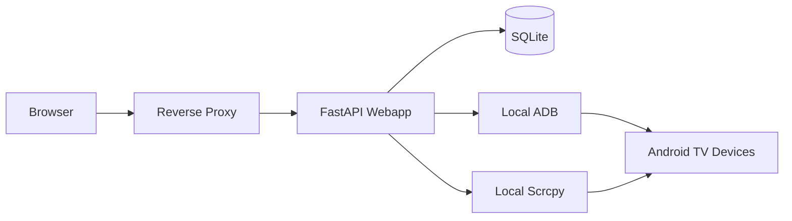
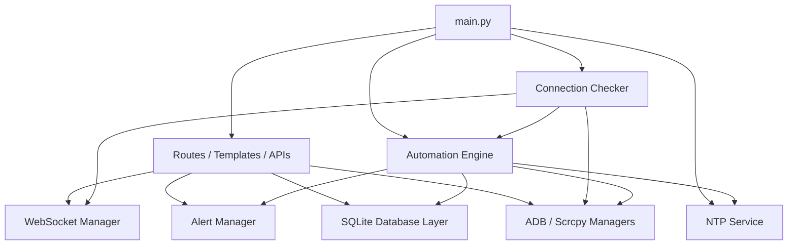
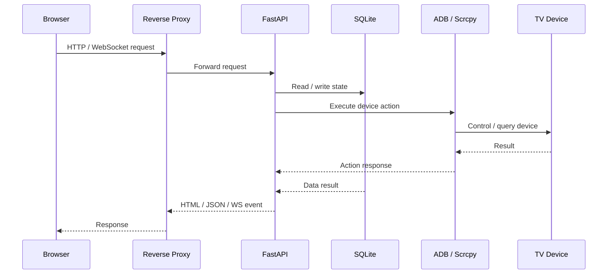

# ADBController


Web-based Android TV / ADB control center built with FastAPI, Jinja2, WebSocket, SQLite, and local ADB/Scrcpy tooling.

Architecture document:

- [docs/architecture.md](/d:/LAB/TV_Data_collection/docs/architecture.md)

## Architecture Overview

### System Context



### Runtime Components



### Request / Action Flow



## Stack

- Backend: FastAPI + Uvicorn
- Frontend: Jinja2 templates + static JS/CSS
- Styling: Tailwind CLI
- Database: SQLite
- Realtime: WebSocket
- Device control: ADB
- Screen mirroring: Scrcpy

## Repository Layout

```text
.
|- webapp/         # Main FastAPI application
|- client_agent/   # Optional Scrcpy client agent
|- scrcpy/         # Local third-party binaries (not committed by default)
`- README.md
```

## Main App Structure

```text
webapp/
|- routes/         # FastAPI routers
|- services/       # Device inventory helpers
|- static/         # CSS / JS assets
|- templates/      # Jinja2 HTML templates
|- scripts/        # Maintenance scripts
|- main.py         # App entry point
|- database.py     # SQLite access layer
|- models.py       # Pydantic models
`- requirements.txt
```

## Requirements

- Python 3.11 recommended
- Node.js + npm for CSS build
- ADB installed or available in one of the auto-detected paths
- Scrcpy optional, required only for Scrcpy features

## Local Development

### 1. Install Python dependencies

```powershell
cd webapp
py -m pip install -r requirements.txt
```

### 2. Install frontend build dependencies

```powershell
npm install
```

### 3. Build CSS

```powershell
npm run build:css
```

For development watch mode:

```powershell
npm run watch:css
```

### 4. Run the web application

```powershell
py main.py
```

Alternative:

```powershell
py -m uvicorn main:app --host 0.0.0.0 --port 8000
```

Open:

```text
http://localhost:8000
```

## ADB / Scrcpy Path Detection

The app auto-detects ADB and Scrcpy from common Windows and Linux paths in [webapp/config.py](/d:/LAB/TV_Data_collection/webapp/config.py).

You can also override with environment variables:

```powershell
$env:ADB_PATH="C:\path\to\adb.exe"
$env:SCRCPY_PATH="C:\path\to\scrcpy.exe"
```

## Optional Environment Variables

- `HOST`
- `PORT`
- `ADB_PATH`
- `SCRCPY_PATH`
- `CSV_PATH`

## Docker

The repo includes:

- [webapp/Dockerfile](/d:/LAB/TV_Data_collection/webapp/Dockerfile)
- [webapp/docker-compose.yml](/d:/LAB/TV_Data_collection/webapp/docker-compose.yml)

Quick start:

```powershell
cd webapp
docker compose up --build
```

Note:

- The current compose file uses host networking
- SQLite is file-based
- ADB/Scrcpy features depend on the host/container environment

## Screenshots

This repository currently does not include product screenshots.

Screenshot folder guide:

- [docs/screenshots/README.md](/d:/LAB/TV_Data_collection/docs/screenshots/README.md)

Recommended screenshots to add later:

- Login page
- Dashboard device monitor
- Devices inventory page
- Remote control view
- Reports page
- Automation workflow builder
- Settings page
- Scrcpy agent page

Suggested repository location for future screenshots:

```text
docs/screenshots/
```

Suggested markdown once screenshots are available:

```md
## Screenshots

### Dashboard


### Devices


### Automation

```

## API / Feature Overview

### Web Pages

Main HTML pages currently served by the app:

- `/` - landing page
- `/login` - authentication page
- `/dashboard` - device monitoring dashboard
- `/devices` - device inventory management
- `/reports` - report history and export flow
- `/report-form` - report generation form
- `/documents` - document upload and viewing
- `/settings` - SMTP, Interchat, NTP, user, and plant settings
- `/automate` - workflow automation builder and logs
- `/remote/{ip}` - remote control page for a device
- `/multiview` - multi-device screenshot monitoring
- `/scrcpy-agent` - Scrcpy agent setup and quick connect page

### API Groups

Main API groups in `webapp/routes/`:

- `/api/auth` - login, logout, session check, password change
- `/api/devices` - inventory CRUD, connect, ping, health, rename, reboot, shutdown, locks
- `/api/dashboard` - cached status, ping, checker interval, refresh
- `/api/app` - open app, app status, clear data, install APK, cache operations
- `/api/report-templates` - report template CRUD
- `/api/report` and `/api/reports` - report generation, download, history, email send
- `/api/screenshots` and `/api/screenshot` - screenshot listing, capture, cleanup, stats
- `/api/settings` - system settings, SMTP test, Interchat test, NTP status, sync-now
- `/api/users` - user management
- `/api/plants` - plant management
- `/api/automation` - workflow CRUD, toggle, dry-run test, logs, engine status
- `/api/documents` - document upload, list, download, delete
- `/api/remote` - tap, swipe, key input, text input, remote stop
- `/api/scrcpy` - agent heartbeat, package download, launch, close, agent discovery

### Realtime Features

- `/ws` - global application websocket for realtime logs
- `/ws/remote/{ip}` - remote control session websocket
- `/ws/multiview/screenshots` - multiview screenshot streaming websocket

### Key Features

- Device inventory managed through the web UI
- Plant-aware access control for device visibility
- ADB actions for connect, ping, rename, reboot, shutdown, and app control
- Screenshot capture and multiview monitoring
- Report generation, template management, and email delivery
- SMTP and Interchat integration from Settings
- NTP-based time sync for scheduler accuracy
- Workflow automation with schedule, conditions, logs, and dry-run testing
- Optional Scrcpy integration with downloadable client agent

## Production Recommendation

Best fit for the current codebase:

```text
Browser -> Reverse Proxy -> FastAPI (single instance) -> SQLite + local ADB/Scrcpy
```

Why:

- background services start inside the main FastAPI process
- SQLite is local file storage
- ADB and Scrcpy are executed as local subprocesses

Avoid running multiple app instances unless the background job model and database architecture are redesigned first.

## Client Agent

Optional Scrcpy client agent source is in [client_agent](/d:/LAB/TV_Data_collection/client_agent).

Install dependencies:

```powershell
cd client_agent
py -m pip install -r requirements.txt
```

Run:

```powershell
py client_agent.py
```

## Security Notes

- Do not commit local database files
- Do not commit `.admin_credentials`
- Do not commit `.db_path`
- Do not commit runtime output folders such as reports, screenshots, and documents

These are already covered by [.gitignore](/d:/LAB/TV_Data_collection/.gitignore).

## First-Time Setup Checklist

1. Install Python dependencies in `webapp/`
2. Install npm dependencies in `webapp/`
3. Build CSS
4. Ensure ADB is installed and reachable
5. Run `py main.py`
6. Open `http://localhost:8000`

## Notes

- This repository does not include local production database content
- Local admin credentials are environment-specific and should be created on first setup
- Scrcpy binary folders are intentionally excluded from Git by default
