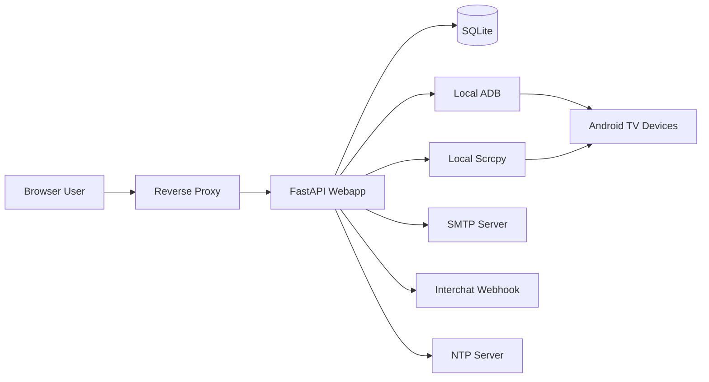
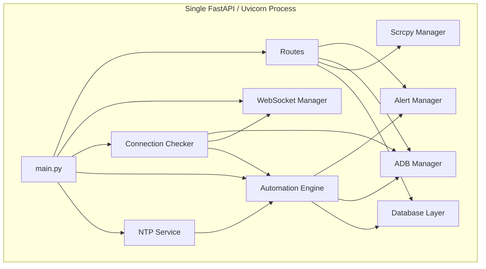
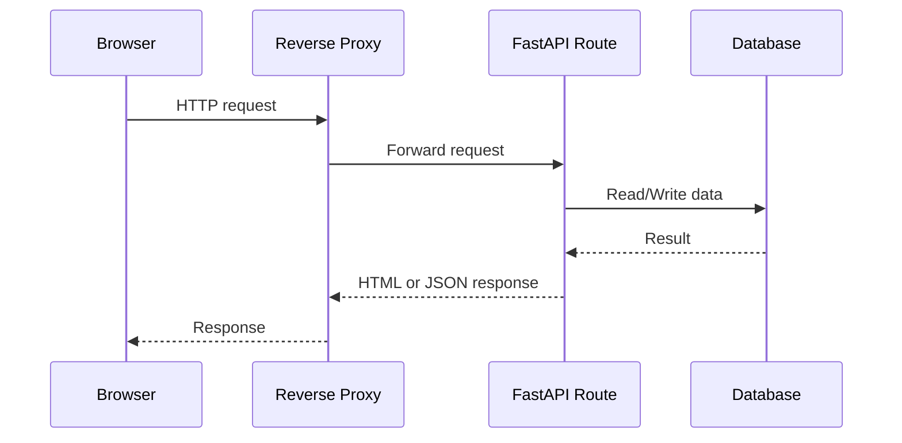
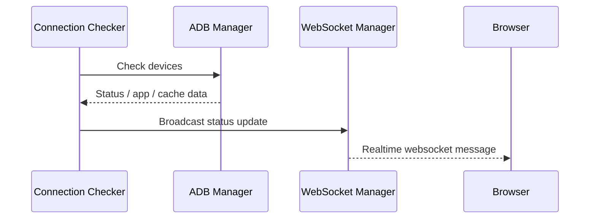
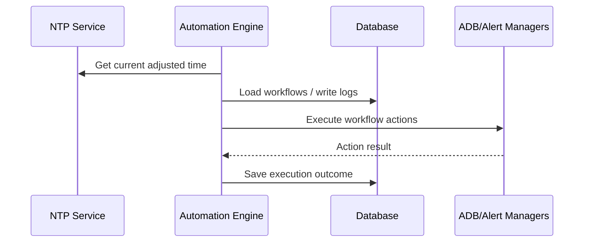

# Webapp Architecture

This document describes the current runtime architecture of the `webapp` based on the code in this repository.

Scope:

- FastAPI application in `webapp/`
- Background services started from `webapp/main.py`
- SQLite persistence in `webapp/database.py`
- Local ADB / Scrcpy execution paths

## 1. System Context



## 2. Runtime Topology

The FastAPI app is the main runtime. It serves HTML pages, APIs, and WebSocket endpoints, and also starts background services during application startup.



## 3. Main Components

### FastAPI application

- Entry point: `webapp/main.py`
- Responsibilities:
  - create FastAPI app
  - mount static files
  - register routers
  - start and stop background services

### Routers

Main route groups currently registered from `webapp/routes/`:

- auth
- pages
- devices
- app
- reports
- templates
- remote
- settings
- dashboard
- users
- screenshots
- scrcpy
- automation
- documents
- plants

### Database layer

- File-based SQLite access in `webapp/database.py`
- DB path is resolved from:
  - `webapp/.db_path` if present
  - fallback DB files under `webapp/`

### WebSocket layer

- Global manager in `webapp/websocket_manager.py`
- Used for:
  - realtime logs
  - status updates
  - progress updates

### Connection Checker

- Background service in `webapp/connection_checker.py`
- Started from FastAPI lifespan
- Responsibilities:
  - load monitored devices
  - check device connectivity
  - collect app status and cache information
  - broadcast status updates
  - trigger automation event evaluation

### Automation Engine

- Background service in `webapp/automation_engine.py`
- Started from FastAPI lifespan
- Responsibilities:
  - load enabled workflows
  - evaluate schedule-based triggers
  - evaluate event-based triggers
  - execute workflow actions
  - write automation logs

### NTP Service

- Background service in `webapp/ntp_service.py`
- Started from FastAPI lifespan
- Provides adjusted time used by the scheduler

### ADB Manager

- Local device execution layer in `webapp/adb_manager.py`
- Responsibilities:
  - connect to devices
  - run ADB commands
  - capture screenshots
  - control apps
  - send input events

### Scrcpy Manager

- Local Scrcpy integration in `webapp/scrcpy_manager.py`
- Responsibilities:
  - launch and close Scrcpy sessions
  - prepare Scrcpy server forwarding and client execution

### Alert Manager

- Integration layer in `webapp/alert_manager.py`
- Responsibilities:
  - send SMTP email
  - send Interchat webhook messages
  - deliver daily reports

## 4. Request Flow

### Normal web request



### Realtime status flow



### Automation schedule flow



## 5. Deployment Recommendation

Best-fit production model for the current code:

```text
Browser -> Reverse Proxy -> FastAPI (single instance) -> SQLite + local ADB/Scrcpy
```

Why this matches the code:

- background services are started inside `main.py`
- scheduler and runtime state are stored in-process
- SQLite is file-based
- ADB and Scrcpy are executed as local subprocesses

## 6. Current Constraints

These are current architecture constraints visible from code:

- single-process design is the safest operating mode
- multiple app instances may duplicate scheduler and background work
- SQLite is not ideal for horizontal scaling
- ADB / Scrcpy features depend on local host access to binaries and network-reachable devices

## 7. Recommended Production Layout

```text
[Browser]
    |
    v
[Reverse Proxy: IIS / Caddy / Nginx]
    |
    v
[FastAPI + Uvicorn: 1 instance]
    |
    +--> [SQLite DB file]
    +--> [ADB executable]
    +--> [Scrcpy executable]
    +--> [SMTP / Interchat / NTP]
    +--> [Android TV devices]
```

## 8. Future Evolution Path

If the system grows beyond single-instance operation, the next step would be:

```text
Browser -> Reverse Proxy -> FastAPI Web/API -> PostgreSQL
                                   |
                                   +-> Separate worker for automation / monitoring
```

That is not the current runtime model, but it is the cleanest upgrade path from the codebase as it exists today.
